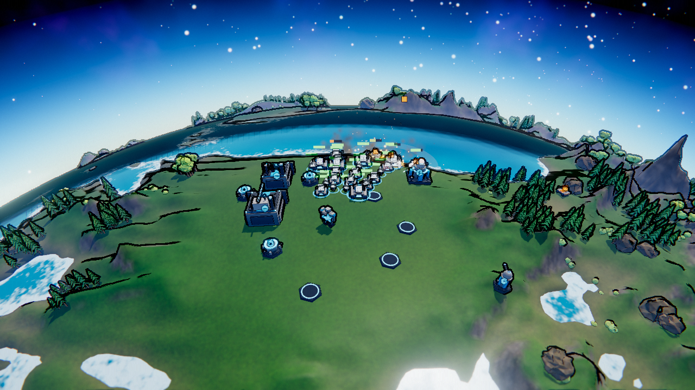
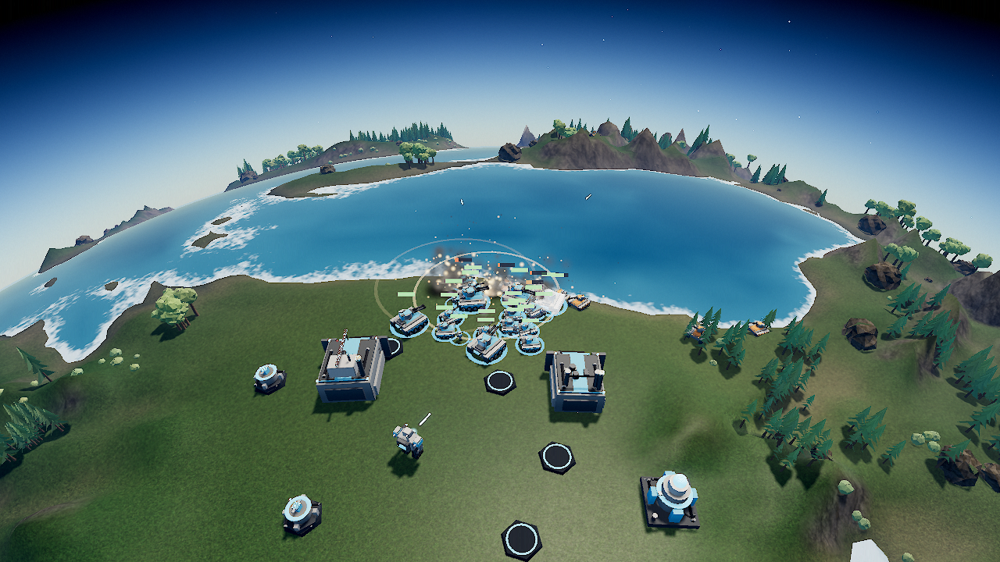

# Titan Annihilation v2 playtest and release evaluation

2026-09-05. Original source: `9ad79c5` (v3.8.0). Tactical game implementation: `91921da`. The edition is isolated under `/v2`; the original root game remains available.

[Play v2](https://majieddd.github.io/titan-annihilation/v2/) · [Play original](https://majieddd.github.io/titan-annihilation/) · [Inspect all 51 models](https://majieddd.github.io/titan-annihilation/v2/catalog.html)

## Findings and repairs

| Observed issue | Result in v2 |
|---|---|
| Extractor placement required a second click because the ghost retained the preceding mouse position | Click-time position and validity refresh; single-click placement passes a real input-handler test |
| A/S simultaneously controlled the camera and attack/stop | Arrow-key camera controls; A/S exclusively issue unit commands |
| Certain art-style changes regenerated the world and lost the current match | Appearance changes preserve game identity, time, selection and orders |
| Fixed-tick transforms and disconnected limb pieces made machines step and slide | Interpolated pose, turret, gait and recoil; shared hip/knee pivots, coordinated arm motion and matching animated normals/shadows |
| Heavy terrain outlines, bloom, sky noise and early icons obscured models | Tactical PBR material treatment, clearer team armor, restrained postprocessing and shockwaves, later strategic icon transition |
| Frequent panel reconstruction replaced focused controls | Structural panel keys preserve controls while costs, health and production progress update |
| Concurrent construction could spend against stale demand estimates | Every job is limited by the team's remaining metal and energy for the tick |
| Damaged units had no direct paid field-repair order | Builders right-click damaged allies to repair for 60% of replacement cost; commander repair uses a bounded 3000-metal basis |
| Terrain, hidden props and large render targets consumed excessive work | Lower terrain subdivision, horizon culling, bounded pixels, adaptive resolution, tiered shadows and less frequent environment capture |
| A fixed per-type instance capacity could omit large armies | Instance buffers grow instead of silently dropping models; 601-instance test passes |
| Opening priorities and idle production were difficult to read | Guided economy/factory/army objectives, commander health, efficiency and idle production controls |

The nine existing CC0 texture families are retained and their material response is tuned. This is a procedural model and animation refinement; it does not claim 51 newly authored or externally rigged assets.

## Measured comparison

Same host, Chrome, seed `titan`, five worlds, high quality, 1280x720, DPR 1, fixed resolution, opening camera at distance 110. Each build uses its intended default art style. 10 warm-up frames precede 120 measured frames. A GPU completion fence measures synchronous render work independently of background-tab timer throttling.

| Metric | Original | Tactical v2 |
|---|---:|---:|
| Mean render work | 6.57 ms | 2.59 ms |
| 95th percentile | 8.20 ms | 3.90 ms |
| Rendered triangles, including passes | 11,586,554 | 1,480,355 |
| Draw calls | 98 | 65 |

Mean work fell **60.5%**, with **87.2% fewer rendered triangles** in this scene. This does not measure simulation cost in a late-game army, loading time, mobile hardware or actual monitor FPS. Background browser automation throttled animation frames, so its on-screen FPS readout was not used to claim performance. Saved JSON records preserve the method and raw summaries.

The built HTML is about 468 KiB versus the original's roughly 4 MiB. This is an HTML payload comparison: shared textures and CDN dependencies still download separately.

## Playtest evidence

- The public original was manually played through landing, commander selection and extractor placement. Its local full AI match ended naturally after 1825.42 simulated seconds with 2109 units built across both teams.
- The v2 release bundle passed **40 checks, zero failures**, including production/rally/loop, paid repair, resource conservation, orbital transfer, paired teleporters, anti-nuke interception, all five worlds, settings, focus preservation, model visibility and one terminal victory event.
- A full release AI match ended naturally after 386.90 simulated seconds with 429 units built and 305 units remaining. A preceding development match also reached defeat. These are completion and stability checks, not enough samples to establish competitive balance.
- Manual browser review covered menu, unit selection, settings, visible keyboard focus, all 51 model previews and the three titan models. The tested 375, 768 and 1280 pixel widths have no horizontal page overflow or clipped visible buttons. A 39-sample visible text audit had no contrast failures, with a minimum measured ratio of 8.76:1.
- Console checks found no game/shader errors in the tested release paths.

## Battlefield comparison

These captures come directly from the two games' WebGL canvases, using the same seeded showcase recipe and six simulated seconds of real combat. They omit the HTML HUD. Terrain sampling and the random simulation sequence differ, so they are comparable scenarios, not pixel-registered renders of identical unit states.

Original:

Tactical v2:

## Recommended next work

1. **Formation and choke-point behavior.** The shoreline showcase still packs tanks tightly. Improve local separation and formation width, then measure arrival rate, congestion and firing opportunities on multiple land layouts.
2. **Multi-seed balance and onboarding.** Run at least 20 seeds per difficulty, record commander survival, first factory time and economy stalls. The much shorter v2 AI match is not by itself evidence of better balance.
3. **More distinct unit silhouettes and authored motion.** The procedural roster shares several base chassis. Prioritize scout, tank, anti-air, artillery and builder silhouettes; then add turn-in-place and foot-planting to the larger walkers with gameplay-speed synchronization.
4. **Late-game profiling on more hardware.** The opening render benchmark is encouraging. Profile 500-1000-unit battles, pathfinding spikes, particle overdraw and memory across repeated restarts on integrated GPUs before raising visual defaults.
5. **Separate feature tracks.** Fog of war, match saves, multiplayer and touch controls each need their own design and tests. They are not implemented in this edition.

Raw results: [regression](evidence/v2-regression.json), [full v2 match](evidence/v2-full-match.json), [original full match](evidence/baseline-full-match.json), [original benchmark](evidence/baseline-benchmark.json), [v2 benchmark](evidence/v2-benchmark.json), [UI audit](evidence/v2-ui-audit.json).
